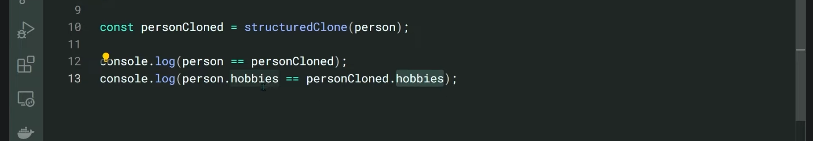
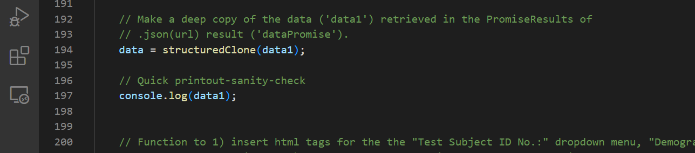
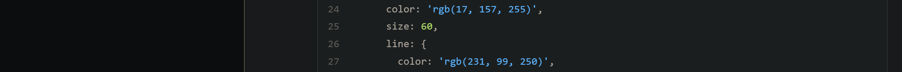
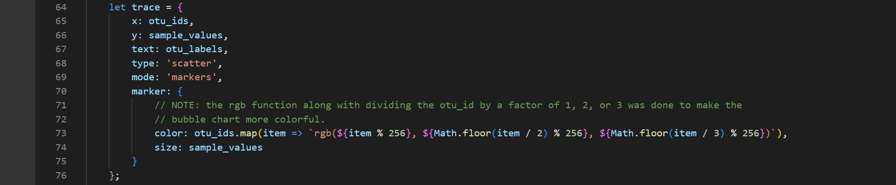
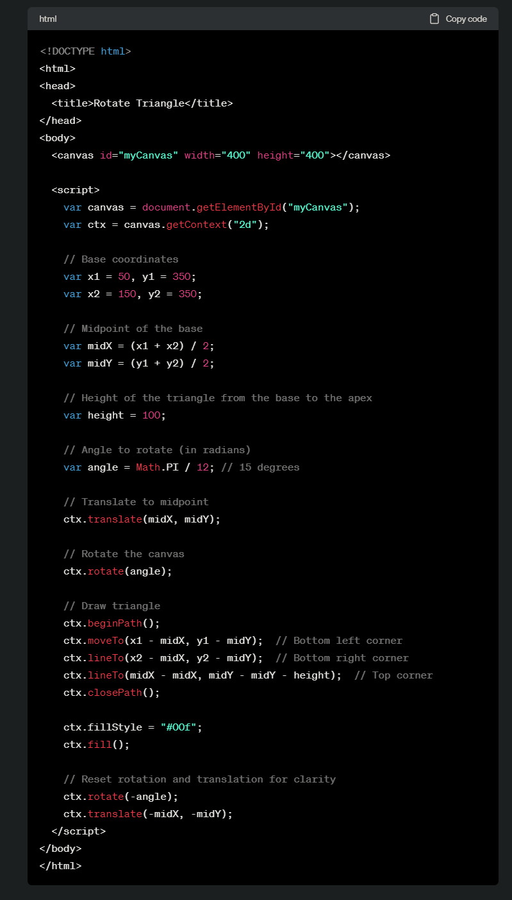
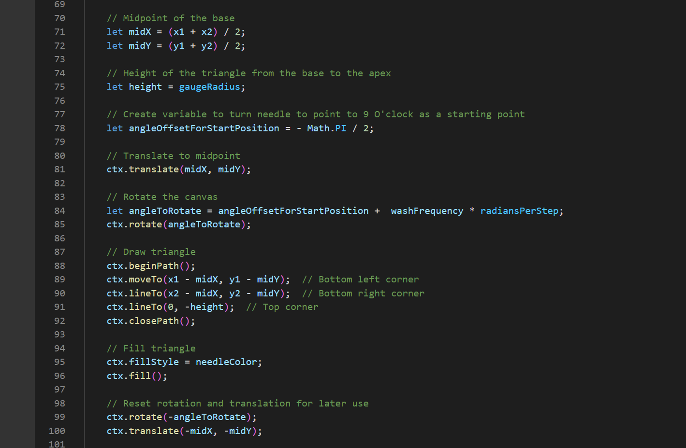

# belly-button-challenge

 #### By Karoly Burygan
---
### A Dashboard Overview For Test Subjects
In this project, an interactive dashboard was created to "explore the Belly Button Biodiversity" via a bar chart showing a test subject's top ten most populous Operational Taxonomic Units (OTUs (-- microbes)), a bubble chart showing all OTU populations present in his/her navel, along with some of his/her demographic data, and bathing frequency. 
By exploring these test subjects' data, it can be seen that there is no one pattern that the OTU distributions follow and there are likely a multiplicity of factors that cause the variations observed.

#### <a href='https://cburgyan.github.io/belly-button-challenge/'>Click Here the Github Page</a>
---
#### NOTE: On the bonus.js, Plotly was NOT used to create the gauge -- the gauge was created "from scratch" using the canvas tag and it's functions.
---
## Sources:
<ol>
    <li>
        "The Best Way to Deep Copy Objects or Arrays in JavaScript - structuredClone()". dcode. Sept. 7, 2022. https://www.youtube.com/watch?v=LnBxD1aXw7I&t=330s   
                
                  
                Used in app.js line 194 here:   
        <ul>
            <li>
                
 
            </li>
        </ul>
   </li>
   <li>
        "Styling Markers in JavaScript". Plotly.com. n.d. https://plotly.com/javascript/marker-style/  
                  
                Used in app.js line 73 here:   
        <ul>
            <li>
                  
 
            </li>
        </ul>
   </li>
   <li>
        Question to ChatGPT "is there a way to draw an isosceles triangle that rotates at the midpoint of its base?". ChatGPT. Sept 20, 2023. https://chat.openai.com/  
                  
                Partially used between lines 70 and 100 in bonus.js:   
        <ul>
            <li>
                  
                

 
            </li>
        </ul>
   </li>

</ol>
