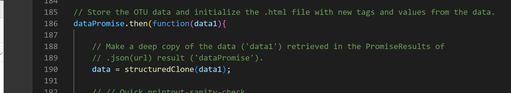
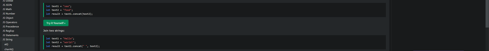
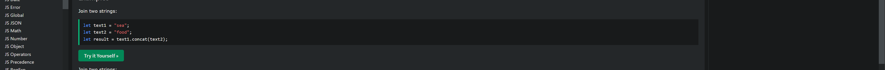
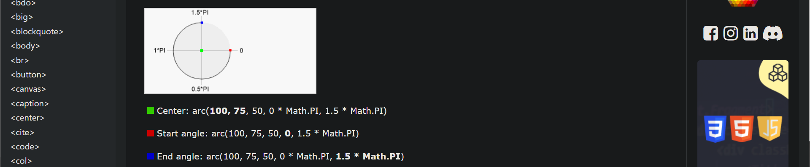

# belly-button-challenge

 #### By Karoly Burygan
---
## Sources:
<ol>
    <li>
        "The Best Way to Deep Copy Objects or Arrays in JavaScript - structuredClone()". dcode. Sept. 7, 2022. https://www.youtube.com/watch?v=LnBxD1aXw7I&t=330s   
                
                  
                Used in app.js line 229 here:   
        <ul>
            <li>
                
                data = structuredClone(data1);
 
            </li>
        </ul>
   </li>
   <li>
        "Styling Markers in JavaScript". Plotly.com. n.d. https://plotly.com/javascript/marker-style/  
                  
                Used in app.js line 70 here:   
        <ul>
            <li>
                    

                    color: otu_ids.map(item => `rgb(
                        ${item % 256}, 
                        ${Math.floor(item / 2) % 256}, 
                        ${Math.floor(item / 3) % 256})`)
 
            </li>
        </ul>
   </li>
   <li>
        "JavaScript String concat()". Refsnes Data. n.d. https://www.w3schools.com/jsref/jsref_concat_string.asp  
                  
                Used in app.js line 70 here:   
        <ul>
            <li>
                
                let otu_ids = sortedOTUsBySampleValue.otu_ids.
                    slice(0,10).map(item => 'OTU '.concat(
                        item.toString())).reverse();
 
            </li>
        </ul>
   </li>
   <li>
        "JavaScript NUmber toString()". Refsnes Data. n.d. https://www.w3schools.com/jsref/jsref_tostring_number.asp  
                  
                Used in app.js line 70 here:   
        <ul>
            <li>
                Used in app.js line 18 here: 
                
                let otu_ids = sortedOTUsBySampleValue.otu_ids.
                    slice(0,10).map(item => 'OTU '.concat(
                        item.toString())).reverse();
 
            </li>
        </ul>
   </li>
   <li>
        "Canvas arc() Method". Refsnes Data. n.d. https://www.w3schools.com/tags/canvas_arc.asp  
                  
                Used in bonus.js line 29 here:   
        <ul>
            <li>
                
                ctx.arc(gaugeX, gaugeY, gaugeRadius,  Math.PI + i * radiansPerStep, Math.PI + (i + 1) * radiansPerStep);
 
            </li>
        </ul>
   </li>
   <li>
        Question to ChatGPT "is there a way to draw an isosceles triangle that rotates at the midpoint of its base?". ChatGPT. Sept 20, 2023. https://chat.openai.com/  
                  
                Used in bonus.js line 29 here:   
        <ul>
            <li>
                

                
    //Draw and Rotate Needle
    // The Needle will be a triangle
    // Here are the coordinates for the base of the triangle in terms of the gauge location where
    // it will be positioned.
    let x1 = gaugeX - 5;
    let y1 = gaugeY;
    let x2 = gaugeX + 5;
    let y2 = gaugeY;

    // Midpoint of the base
    let midX = (x1 + x2) / 2;
    let midY = (y1 + y2) / 2;

    // Height of the triangle from the base to the apex
    let height = gaugeRadius;

    // Create variable to turn needle to point to 9 O'clock as a starting point
    let angleOffsetForStartPosition = - Math.PI / 2; 

    // Translate to midpoint
    ctx.translate(midX, midY);

    // Rotate the canvas
    let angleToRotate = angleOffsetForStartPosition +  washFrequency * radiansPerStep;
    ctx.rotate(angleToRotate);

    // Draw triangle
    ctx.beginPath();
    ctx.moveTo(x1 - midX, y1 - midY);  // Bottom left corner
    ctx.lineTo(x2 - midX, y2 - midY);  // Bottom right corner
    ctx.lineTo(0, -height);  // Top corner
    ctx.closePath();

    // Fill triangle
    ctx.fillStyle = "#700";
    ctx.fill();

    // Reset rotation and translation for later use
    ctx.rotate(-angleToRotate);
    ctx.translate(-midX, -midY);
 
            </li>
        </ul>
   </li>

</ol>

---
#### See the Github Page @ https://cburgyan.github.io/belly-button-challenge/